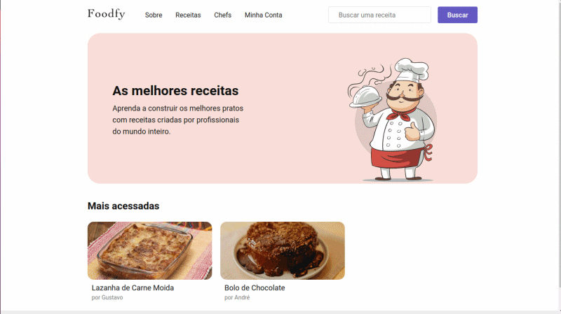

<h1 align="center">
    
</h1>

  
Aprenda a construir os melhores pratos com receitas criadas por profissionais do mundo inteiro.

  
  
  

## Tópicos 

[Sobre o Foodfy](#sobre-o-foodfy)

[Funcionalidades](#funcionalidades)

[Tecnologias e Ferramentas](#tecnologias-e-ferramentas)

[Licença](#licença)

 

## Sobre o Foodfy

O Foodfy é uma aplicação web completa de gerenciamento de receitas.

<h3 align="center">Imagens do Projeto</h3>

  

 

## Funcionalidades

- [X] Explore variados tipos de receitas.
- [X] Gerencie receitas, chefs e usuários.
- [X] Upload de imagems com Multer.
- [X] Pesquisar receitas.
- [X] Páginas dinâmicas com Nunjucks.
- [X] Banco de dados PostgreSQL.
- [X] Sistema de login e recuperação de senha.
- [X] Área administrativa.

 

## Tecnologias e Ferramentas

As seguintes tecnologias foram utilizadas no desenvolvimento do projeto:

- [HTML](https://devdocs.io/html/)
- [CSS](https://devdocs.io/css/)
- [JavaScript](https://devdocs.io/javascript/)
- [Nunjucks](https://mozilla.github.io/nunjucks/)
- [NodeJS](https://nodejs.org/en/)
- [Nodemailer](https://nodemailer.com/about/)
- [Express](https://expressjs.com/)
- [Express Session](https://github.com/expressjs/session)
- [Multer](https://github.com/expressjs/multer)
- [PostgreSQL](https://www.postgresql.org/)
- [BcryptJS](https://github.com/dcodeIO/bcrypt.js)
- [Faker.js](https://github.com/Marak/Faker.js)

 

### licença
Esse projeto está sob a licença MIT. Veja o arquivo [LICENSE](/LICENSE) para mais detalhes.

---

Feito com :purple_heart: by [Michael W.Lopes](https://github.com/michael23-lopes)

 

